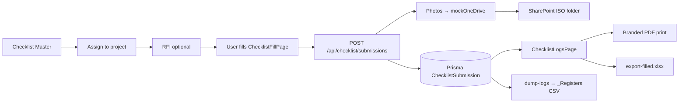
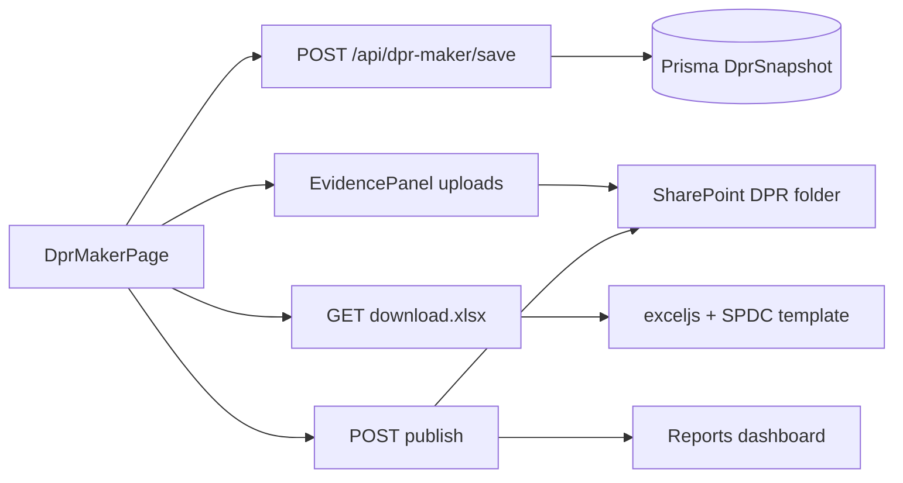
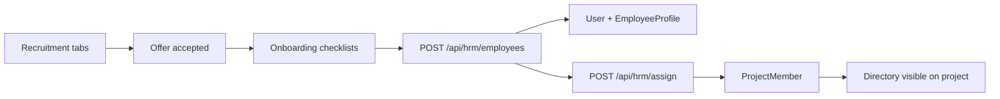

# Sharnam Portal — Connectivity & Build Review

**Purpose:** Single document to review what is built, how modules connect (UI ↔ API ↔ SharePoint ↔ database), and what still needs improvement.

**Last updated:** 2026-08-10 · **Live demo:** https://sharnam-portal.onrender.com  
**Demo login:** `office@sharnam.demo` / `Demo@1234`

---

## 1. Architecture at a glance

```
┌─────────────────────────────────────────────────────────────────────────┐
│  Browser (React + Vite)                                                  │
│  AppShell → Workspace modules → Project tools → Forms / modals           │
└───────────────────────────────┬─────────────────────────────────────────┘
                                │ REST + JWT (Bearer)
                                ▼
┌─────────────────────────────────────────────────────────────────────────┐
│  Express API (apps/api)                                                  │
│  Prisma → SQLite (Render demo) / Postgres (production target)            │
│  mockOneDrive service → local uploads/ OR SharePoint via Graph API       │
└───────────────────────────────┬─────────────────────────────────────────┘
                                │
              ┌─────────────────┴─────────────────┐
              ▼                                   ▼
   ┌──────────────────────┐            ┌──────────────────────┐
   │  SharePoint          │            │  Microsoft Graph      │
   │  Sharnam Portal/     │            │  Mail (pmc-portal@)   │
   │  {ProjectCode}/…     │            │  (when consented)     │
   └──────────────────────┘            └──────────────────────┘
```

| Layer | Location | Notes |
|-------|----------|-------|
| Frontend | `apps/web/src/` | React 19, workspace IA in `workspaces.ts` |
| Backend | `apps/api/src/` | Express routers per domain |
| Shared types | `packages/shared/` | Roles, enums |
| Schema | `prisma/schema.prisma` | All transactional data |
| SharePoint tree | `apps/api/src/services/graph.ts` → `PROJECT_LIBRARY_FOLDERS` | 111 ISO folders per project |
| Upload bridge | `apps/api/src/services/mockOneDrive.ts` | Writes local + SharePoint when `MOCK_ONEDRIVE=false` |
| Module specs | `docs/modules/MODULE_*.md` | Field-level requirements for review |
| Handover | `docs/PMC_DMS_HANDOVER.md` | ISO folder map, RFI streams |

---

## 2. How navigation connects

### 2.1 Global (office) routes

| Sidebar link | Route | Page | API prefix |
|--------------|-------|------|------------|
| Dashboard | `/dashboard` | `DashboardPage` | `/api/projects`, KPIs |
| Modules | `/workspace` | `WorkspacePage` | — |
| Master setup | `/master` | `MasterModulePage` | `/api/projects`, modules toggle |
| CRM · Bids | `/crm` | `CrmPage` | `/api/crm` |
| Quotation maker | `/quotations/new` | `QuotationMakerPage` | `/api/crm/quotations` |
| HRMS | `/hrm/*` | `HrmsLayout` + sub-pages | `/api/hrm/*` |
| Custom sheets | `/custom-sheets` | `CustomSheetsPage` + editor | `/api/custom-sheets` |
| Upload lab | `/upload-lab` | `UploadLabPage` | `/api/site-test`, `/api/graph` |
| Access · Users | `/roles` | `RolesPage` | `/api/hrm/employees`, `/api/roles` |
| Audit trail | `/audit` | `AuditPage` | `/api/audit` |

### 2.2 Project-scoped routes

All project tools live under **`/projects/:id/{tool}`** inside `ProjectToolsLayout`.

**Module hub** (Procore-style card grid): `/projects/:id/hub/{drawings|quality|safety|progress|field|comms|cost|finance|reports}`

Hub card definitions → `apps/web/src/workspaces.ts` → `MODULE_TOOLS` + `MODULE_META`.

**Project home** → shortcuts to enabled modules + DPR/WPR makers.

### 2.3 Auth & portals

| Surface | Route | Roles |
|---------|-------|-------|
| Login hub | `/login` | — |
| Per-portal login | `/login/{office\|site\|vendor\|…}` | Filters `allowedRoles` on login |
| Post-login landing | Stored in `localStorage` `sharnam_login_landing` | Per portal config in `PortalLogins.tsx` |

---

## 3. Cross-cutting connections

### 3.1 SharePoint / DMS (document spine)

Every upload-capable module ultimately calls **`mockOneDrive.upload(projectCode, folder, file)`**, which:

1. Saves to `uploads/onedrive/{projectCode}/…` (always, as fallback)
2. If Graph configured → also **`uploadToProjectLibrary`** → SharePoint `Documents/Sharnam Portal/{ProjectCode}/{ISO path}`

| UI entry | API | SharePoint folder (typical) |
|----------|-----|----------------------------|
| **DMS browse/upload** | `GET/POST /api/dms/:projectId/*` | Any ISO folder user picks |
| **DPR maker** (photo/PDF/sign) | `/api/dpr-maker/:projectId/photo\|attachment\|signature` | `07.02_Daily_Site_Records/DPR/{discipline}` |
| **WPR maker** | `/api/wpr-maker/:projectId/*` | `07.08_Progress_Measurement_SCurve/WPR` |
| **Site pilot / Upload lab** | `/api/site-test/:projectId/upload` | `07.02…/UploadLab` or `SitePilot` |
| **Drawing revision upload** | `/api/drawings/:id/revisions` | `04.02_Drawings_and_Specifications` |
| **Checklist photos** | `/api/checklist/submissions` (multipart) | Per checklist family folder |
| **Register CSV dumps** | `POST /api/dms/:projectId/dump-logs` | `_Registers/` |

**DMS UI:** `DmsPage.tsx` — folder tree (111 paths), breadcrumbs, file table, PDF preview, upload modal.  
**Sync:** `POST /api/dms/:projectId/sync` creates full ISO tree on SharePoint (run once per project).

### 3.2 Audit trail

`audit(event, { userId, entity, entityId, meta })` — written on uploads, checklist submit, HR actions, Graph tests.

**UI:** `/audit` · **API:** `/api/audit`  
**HR timeline:** `GET /api/hrm/employees/:userId/timeline`

### 3.3 Checklist system (shared across Drawings / Quality / Safety / Site)

| Concept | API | UI |
|---------|-----|-----|
| Template master | `POST /api/checklist/templates` | `ChecklistMasterPage` |
| Assign to project | `POST /api/checklist/assign` | `ChecklistAssignPage` |
| Fill (site user) | `POST /api/checklist/submissions` | `ChecklistFillPage` |
| Logs + branded PDF | `GET /api/checklist/project/:id/submissions` | `ChecklistLogsPage` |
| **Full schedule XLSX** | `GET …/export-filled.xlsx` | Admin download with all line answers |
| Quality dashboard | `GET …/quality-dashboard` | `InspectionsPage` |
| Safety dashboard | `GET …/safety-dashboard` | `SafetyPage` |

**Families:** `DrawingCheck` · `SiteExecution` · `QualityInspection` · `Safety`  
**RFI link:** Request fill via `/projects/:id/rfis?kind=…`

### 3.4 RFI streams (three separate tools)

| Stream | UI query | Register prefix | ISO CSV drop |
|--------|----------|-----------------|--------------|
| Information (Ask) | `kind=RequestForInformation` | `RFI-###` | `03.06…/RFI-Information-Log.csv` |
| Quality inspection | `kind=QualityInspection` | `QI-RFI-###` | `08.02…/RFI-Quality-Log.csv` |
| Safety checklist | `kind=SafetyChecklist` | `SAF-RFI-###` | `08.07…/RFI-Safety-Log.csv` |
| Drawing checklist | `kind=DrawingChecklist` | `DWG-RFI-###` | `04.02…/RFI-DrawingChecklist-Log.csv` |

**API:** `/api/rfis/project/:projectId` · **UI:** `RfisPage.tsx`

### 3.5 Evidence / upload UX (shared components)

| Component | Used in |
|-----------|---------|
| `UploadModal` | Drawings, DMS |
| `EvidencePanel` | DPR maker, WPR maker |
| `PhotoCapture` | Site pilot, EvidencePanel |
| `PdfMarkup` + `ImageMarkup` | Site pilot, EvidencePanel, DPR |
| `SignaturePad` | Site pilot, EvidencePanel |

---

## 4. Module-by-module connectivity

Status key: **Live** = end-to-end usable · **Partial** = UI + API but gaps · **Ready** = hub shell only · **Mock** = needs live Graph/data

### 4.1 Master + Home

| Item | Detail |
|------|--------|
| **UI** | `/master`, `/projects/:id` (home) |
| **API** | `POST /api/projects`, `PATCH` modules, `POST /api/projects/:id/members` |
| **Connects to** | Enables workspace keys per project; seeds DMS tree on sync |
| **SharePoint** | Creates `{ProjectCode}` sandbox on sync |
| **Status** | **Live** |
| **Spec** | `docs/modules/MODULE_MASTER_HOME.md` |
| **Review** | Postgres persistence on Render; module toggle UX |

### 4.2 Drawings / GFC

| Item | Detail |
|------|--------|
| **Hub** | `/projects/:id/hub/drawings` |
| **Tools** | `drawings`, `checklist-master?family=DrawingCheck`, `checklist-logs`, `dms`, `coordination`, `rfis` |
| **API** | `/api/drawings/project/:id`, revisions, publish, export CSV |
| **Connects to** | DMS `04.02`, Drawing Check checklists, Information RFIs, Coordination → Ask RFI |
| **Upload gate** | Pre-check checklist optional; publish notifies comms matrix |
| **Status** | **Live** |
| **Spec** | `docs/modules/MODULE_DRAWINGS.md` |

### 4.3 Documents (DMS)

| Item | Detail |
|------|--------|
| **UI** | `/projects/:id/dms` |
| **API** | `GET /folders`, `GET /browse`, `POST /sync`, `POST /upload`, `POST /dump-logs` |
| **Connects to** | All modules that upload files; register dumps to `_Registers/` |
| **SharePoint** | **Live** on Render (`MOCK_ONEDRIVE=false`) |
| **Status** | **Live** (rebuilt Procore-style browser) |
| **Review** | Delta sync; permissions by role; submittal linking |

### 4.4 Quality

| Item | Detail |
|------|--------|
| **Hub** | `/projects/:id/hub/quality` |
| **Tools** | `inspections`, `qap`, `checklist-master?family=QualityInspection`, `checklist-logs`, `rfis?kind=QualityInspection` |
| **API** | `/api/inspections`, `/api/checklist/*`, `/api/safety` (shared patterns) |
| **Connects to** | QAP upload → DMS; QI fills → checklist submissions; NCR/Cube views in `InspectionsPage` |
| **Status** | **Live** (NCR/Cube split views) |
| **Spec** | `docs/modules/MODULE_QUALITY.md` |

### 4.5 Safety

| Item | Detail |
|------|--------|
| **Hub** | `/projects/:id/hub/safety` |
| **Tools** | `safety`, safety checklists, safety fill log, safety RFI |
| **API** | `/api/safety/project/:id`, checklist family `Safety` |
| **Connects to** | Separate from Quality NCR; dumps to `08.07…` |
| **Status** | **Live** |
| **Spec** | `docs/modules/MODULE_SAFETY.md` |

### 4.6 Progress

| Item | Detail |
|------|--------|
| **Hub** | `/projects/:id/hub/progress` |
| **Tools** | Overview, milestones, planned vs actual, hindrance, risk, legal — **Live** |
| **Ready stubs** | S-curve, MS Project, summary schedule, procurement plan |
| **API** | `/api/progress/project/:id/*` |
| **Connects to** | WPR maker pulls progress registers; cost cashflow separate module |
| **Status** | **Partial** (core tabs live; MS Project / S-curve awaiting client sheets) |
| **Spec** | `docs/modules/MODULE_PROGRESS.md` |

### 4.7 Field

| Item | Detail |
|------|--------|
| **Hub** | `/projects/:id/hub/field` |
| **Tools** | `site-pilot`, `diary`, `photos`, field RFIs |
| **API** | `/api/site-test/*`, `/api/diary/*`, photos via procore routes |
| **Connects to** | SharePoint `07.02`; DPR evidence uses same upload pattern |
| **Status** | **Live** |
| **Spec** | `docs/modules/MODULE_FIELD.md` |

### 4.8 Communications

| Item | Detail |
|------|--------|
| **Hub** | `/projects/:id/hub/comms` |
| **Tools** | Matrix, Agenda, MoM, Follow-up, Ask RFI, Email settings |
| **API** | `/api/comms/matrix`, `/meetings`, `/logs`, `/api/projects/:id/emails` |
| **Connects to** | RFIs (Information stream); Outlook via Graph when `GRAPH_MAIL_ENABLED=true` |
| **Status** | **Live** (mail send needs Mail.Send consent) |
| **Spec** | `docs/modules/MODULE_COMMUNICATIONS.md` |

### 4.9 Cost (engineering)

| Item | Detail |
|------|--------|
| **Hub** | `/projects/:id/hub/cost` |
| **Tools** | BOQ monitoring, MB, BBS, budget WBS, cashflow chart/forecast/tracking, rates, COP |
| **API** | `/api/cost/project/:id/*` |
| **Connects to** | Separate from Finance commercial registers; sheet-mode tabs |
| **Status** | **Live** |
| **Spec** | `docs/modules/MODULE_COST.md` |

### 4.10 Finance (commercial)

| Item | Detail |
|------|--------|
| **Hub** | `/projects/:id/hub/finance` |
| **Tools** | Invoices, PO, RA bill, COP tracking |
| **API** | `/api/finance/:projectId/*` |
| **Connects to** | Cost module (engineering) — intentionally separate |
| **Status** | **Partial** (API + shell; deepen UI parity) |
| **Spec** | `docs/modules/MODULE_FINANCE.md` |

### 4.11 Reports (DPR / WPR)

| Item | Detail |
|------|--------|
| **Hub** | `/projects/:id/hub/reports` |
| **Tools** | DPR maker, WPR maker, DPR dashboard, WPR dashboard |
| **API** | `/api/dpr-maker/*`, `/api/wpr-maker/*`, `/api/reports/*` |
| **Connects to** | DPR → SPDC template XLSX (`apps/api/dpr-templates/`); evidence → SharePoint |
| **Status** | **Partial** — DPR **Live** (template byte-for-byte); WPR **Partial** (sections live, not full PPTX template) |
| **Spec** | `docs/modules/MODULE_REPORTS.md` |

### 4.12 HRMS (office-wide)

| Item | Detail |
|------|--------|
| **UI** | `/hrm/*` unified tool rail (`HrmsLayout`) |
| **Tabs** | Dashboard, Recruitment, Onboarding, Attendance, Leave, Payroll, Masters |
| **API** | `/api/hrm/*` split: `reports.ts` (employees, leave, attendance) + `hrmRecruitment.ts` (recruitment→payroll) |
| **Connects to** | `POST /api/hrm/assign` → project membership; audit timeline |
| **Missing per spec** | Personal diary, Training/KRA tabs |
| **Status** | **Live** (integrated UI); **Partial** vs full MODULE_HRMS.md |
| **Spec** | `docs/modules/MODULE_HRMS.md` |

### 4.13 CRM + Quotations

| Item | Detail |
|------|--------|
| **UI** | `/crm`, `/quotations/new`, `/quotations/:id` |
| **API** | `/api/crm/*` |
| **Connects to** | Master → convert bid to project |
| **Status** | **Live** / deepen |
| **Spec** | `docs/modules/MODULE_CRM.md` |

### 4.14 Custom sheets + Sheet maker

| Item | Detail |
|------|--------|
| **UI** | `/custom-sheets`, `/custom-sheets/:id` (row/column editor) |
| **API** | `/api/custom-sheets/*` |
| **Connects to** | Upload XLSX or hand-build grid; export |
| **Status** | **Live** editor |
| **Spec** | `docs/modules/MODULE_SHEET_MAKER.md` |

### 4.15 Directory & Vendors

| Item | Detail |
|------|--------|
| **UI** | `/projects/:id/directory`, `/projects/:id/vendors` |
| **API** | `/api/directory/*`, `/api/vendors/*` |
| **Connects to** | Comms matrix parties; RFI assignees; HR assign |
| **Status** | **Live** |
| **Spec** | `docs/modules/MODULE_DIRECTORY_VENDORS.md` |

### 4.16 Client portal

| Item | Detail |
|------|--------|
| **Login** | `/login/client` |
| **Access** | Published drawings, progress, concerns, WPR/DPR packs |
| **Status** | **Partial** |
| **Spec** | `docs/modules/MODULE_CLIENT_PORTAL.md` |

### 4.17 Upload lab (integration test)

| Item | Detail |
|------|--------|
| **UI** | `/upload-lab` (admin/office) |
| **API** | `/api/site-test/status`, `/api/graph/status`, `/api/site-test/:projectId/upload` |
| **Purpose** | Prove photo · PDF markup · drawing · signature → SharePoint before Hostinger cutover |
| **Status** | **Live** |

---

## 5. Data flow diagrams

### 5.1 Checklist fill → export → SharePoint



### 5.2 DPR maker → client pack



### 5.3 HRMS recruitment → site login



---

## 6. Environment & deployment

| Variable | Purpose | Render (current) |
|----------|---------|------------------|
| `MOCK_ONEDRIVE` | `false` = live SharePoint | `false` |
| `AZURE_TENANT_ID` / `CLIENT_ID` / `SECRET` | Graph auth | Set |
| `SHAREPOINT_SITE_URL` | Site root | `…/sites/SharnamProjects` |
| `GRAPH_MAIL_FROM` | Shared mailbox | `pmc-portal@spdc.in` |
| `GRAPH_MAIL_ENABLED` | Real send vs outbox queue | `true` (needs Mail.Send consent) |
| `DATABASE_URL` | Prisma | `file:./prod.db` (ephemeral on Render free) |

**Configure script:** `scripts/configure-render-m365.sh` + `.env.render.local.example`  
**Hostinger target:** Same env vars + Postgres + custom domain (avoids Chrome Safe Browsing on `*.onrender.com`).

---

## 7. API route index (quick lookup)

| Prefix | Router file | Domain |
|--------|-------------|--------|
| `/api/auth` | `auth.ts` | Login, JWT |
| `/api/projects` | `projects.ts` | Projects, members, emails |
| `/api/dms` | `projects.ts` | Document manager |
| `/api/drawings` | `projects.ts` | GFC register |
| `/api/checklist` | `checklist.ts` | Templates, fills, exports |
| `/api/rfis` | `procore.ts` | All RFI streams |
| `/api/inspections` | `procore.ts` | QI board |
| `/api/safety` | `procore.ts` | Safety register |
| `/api/directory` | `procore.ts` | Project directory |
| `/api/vendors` | `procore.ts` | Vendor packages |
| `/api/diary` | `diary.ts` | Day log |
| `/api/comms` | `comms.ts` | Matrix, meetings, MoM |
| `/api/cost` | `cost.ts` | Engineering cost |
| `/api/finance` | `finance.ts` | Commercial finance |
| `/api/progress` | `progress.ts` | Progress registers |
| `/api/reports` | `reports.ts` | DPR/WPR dashboards, CRM, base HRM |
| `/api/hrm` | `reports.ts` + `hrmRecruitment.ts` | Full HRMS |
| `/api/dpr-maker` | `dprMaker.ts` | SPDC DPR XLSX |
| `/api/wpr-maker` | `wprMaker.ts` | WPR pack |
| `/api/custom-sheets` | `customSheets.ts` | Sheet maker |
| `/api/graph` | `graph.ts` | SharePoint health, upload test |
| `/api/site-test` | `siteTest.ts` | Site pilot / upload lab |
| `/api/audit` | `reports.ts` | Audit log |

---

## 8. Review checklist — mark Keep / Change / Drop

Use this when improving the build. Copy rows into your tracker.

### Platform

- [ ] **Postgres on production** — SQLite resets on Render redeploy
- [ ] **Custom domain** — Chrome phishing flag on `onrender.com`
- [ ] **Mail.Send admin consent** — real email from `pmc-portal@spdc.in`
- [ ] **Role-based DMS** — contractors see only their folders

### UI / UX

- [ ] **Login hub** — logo-centric (done); hero images per portal
- [ ] **Mobile** — sticky bars on DPR/field; HRMS tool rail scroll
- [ ] **Module hub** — every `MODULE_TOOLS` card resolves to a working route
- [ ] **Empty states** — guide user to sync DMS / seed demo

### Module depth

- [ ] **WPR maker** — match `SPDC_Arvind Limited_WPR_50.pptx` slide-for-slide
- [ ] **Progress** — wire S-curve / MS Project when client sheet arrives
- [ ] **Finance UI** — match Cost module polish
- [ ] **HRMS** — diary, training, KRA tabs
- [ ] **Design coordination** — Procore-style export + RFI escalation UI
- [ ] **Client portal** — published-pack-only enforcement audit

### Integration

- [ ] **All uploads** — confirm `provider: sharepoint` in API responses on live
- [ ] **Checklist export** — admin XLSX includes photos URLs
- [ ] **Register dumps** — all modules included in `dump-logs`
- [ ] **DPR evidence** — same SharePoint paths as handover doc §3

---

## 9. Related documents

| Document | Use for |
|----------|---------|
| `docs/modules/README.md` | Per-module field specs index |
| `docs/modules/MODULE_*.md` | Detailed fields + review tables |
| `docs/PMC_DMS_HANDOVER.md` | ISO folder map, RFI rules, SharePoint sandbox |
| `docs/M365_SETUP.md` | Entra app registration steps |
| `docs/CLIENT_REQUIREMENTS.md` | Parent SRS |
| `PRODUCT_IA.md` | Information architecture |
| `apps/web/src/workspaces.ts` | **Source of truth** for hub tools & routes |

---

## 10. Suggested review workflow

1. Open this doc + `docs/modules/README.md` side by side.
2. For each module you care about, open the matching `MODULE_*.md` and mark fields **Keep / Change / Drop**.
3. Click through the **Route** in §4 on the live demo and note UI ↔ API mismatches.
4. Upload a test file in **DMS** and **Upload lab** — confirm it appears in SharePoint under `Sharnam Portal/{ProjectCode}/`.
5. Log gaps in GitHub issues or a shared sheet; reference §8 checklist items.

---

*Generated for connectivity review. Update this file when major modules or routes change.*
