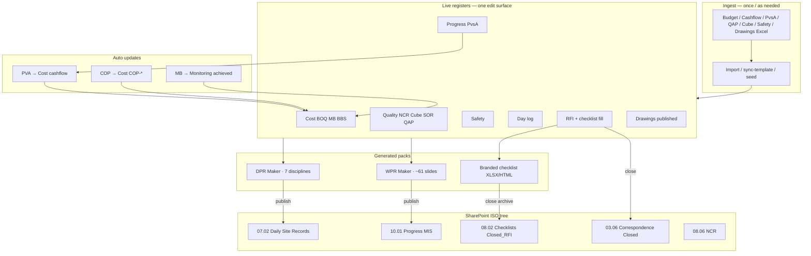

# Master data flow — sheets → portal → SharePoint → DPR / WPR / RFI

Single layered operating model for Sharnam Portal. Source packs:

- `module_prompts/Sharnam_modules_docs 2/` (module Excel / WPR PPT / RFI / Quality / Safety / Cost / Progress)
- `DPR FIles - With Dash Bord (Unzipped Files)/` (7× `SPDC_DPR_*_DASHBOARD.xlsx`)

**Rule:** each business fact has **one edit surface**. Everything else reads or auto-syncs. No dual maintenance.

---

## 1. One-layer map (edit here only)

| Business fact | Edit in portal | Sheet source | Auto consumers |
|---------------|----------------|--------------|----------------|
| BOQ qty / achieved | **Cost → Monitoring** | `SPDC_Budget_Arvind` Monitoring * | DPR lines · Progress BOQ view |
| MB dimensions | **Cost → MB** | Budget `* MB` | Monitoring achieved (sync) · DPR cum qty |
| BBS / rebar kg | **Cost → BBS** | Budget `* BBS` | DPR materials |
| Cashflow ₹ (RA months) | **Progress → PvsA · Cashflow** | `Planned Vs. Actual` · Project Cashflow | **Auto → Cost cashflow (PVA)** · DPR AC · WPR cashflow |
| COP certified ₹ | **Finance → COP** (status) | `Viatrix_RA BILL_COP` | **Auto → Cost COP-*** · overlays Chart |
| Activity qty / wk plan | **Progress → PvsA · Activity** | Planned Vs Actual sheet | DPR planned hints · WPR PvsA |
| Trade manpower shortage | **Progress → PvsA · Manpower** | Weekly Manpower | DPR/WPR manpower |
| Day manpower / notes | **Field → Day log** | (portal) | DPR fallback · WPR · dump-logs |
| Milestones / hindrance / risk / legal | **Progress** tabs | Milestone · Hindrance · Risk · Legal · Overview | WPR · DPR delays |
| QAP week plan | **Quality → QAP** | QAP Week 50 / Quality Dashboard QAP | WPR quality |
| NCR / CAR (quality) | **Quality → NCR** | `NCR 01.xlsx` | DPR quality · WPR |
| Cube tests | **Quality → Cubes** | `SPDC CUBE REGISTER` | DPR · WPR |
| SOR / site instruction | **Quality → SOR** | Quality Dashboard · SOR Log | DPR quality |
| Safety obs / TBT / Safety NCR | **Safety** | Safety Dashboard / Safety NCR | DPR HSE · WPR |
| Checklist fill | **RFI raise → fill → review** | Activity / IR / Safety / RFI forms | Branded export · DPR counts · **SP archive on close** |
| Drawings / GFC | **Drawings** | DRAWING REGISTER · GFC log | Checklist gate · WPR drawing |
| DPR INPUT yellow cells | **DPR Maker** (qtyToday + narrative) | 7 discipline dashboards | Publish → SP `07.02` |
| WPR sections | **WPR Maker** (override OK) | `SPDC_Arvind Limited_WPR_50.pptx` | Publish → SP `10.01` (~61 slides) |

### Planned vs Actual — one layer only

```
Excel import / edit on Progress (?tab=planned&pva=cashflow|manpower|activity)
        │
        ├─ ProgressPlannedActual     (cashflow ₹ + %)
        ├─ ProgressManpower          (trades)
        └─ ProgressActivityLine      (qty register)
                │
                ▼  auto on import + "Sync cashflow → Cost"
        CostCashflowPeriod  packageName = "PVA · …"
                │  (+ overlay Chart / Project cashflow by month label)
                ▼
        DPR header AC · WPR cashflow · Cost cashflow tabs
```

**Do not** hand-edit the same month in both Progress and Cost Chart. Progress owns RA billing; Cost owns display + COP + Budget-derived Chart imports.

---

## 2. End-to-end flow (daily / weekly)



---

## 3. Sheet inventory → portal tool

### DPR templates (`DPR FIles…`)

| File | Discipline | Portal |
|------|------------|--------|
| `SPDC_DPR_CIVIL_DASHBOARD.xlsx` | CIVIL | DPR Maker |
| `SPDC_DPR_ELECTRICAL_DASHBOARD.xlsx` | ELECTRICAL | DPR Maker |
| `SPDC_DPR_FIRE_DASHBOARD.xlsx` | FIRE | DPR Maker |
| `SPDC_DPR_MECHANICAL_DASHBOARD.xlsx` | MECHANICAL | DPR Maker |
| `SPDC_DPR_PEB_ERECTION_DASHBOARD.xlsx` | PEB_ERECTION | DPR Maker |
| `SPDC_DPR_PEB_SUPPLY_DASHBOARD.xlsx` | PEB_SUPPLY | DPR Maker |
| `SPDC_DPR_PLUMBING_DASHBOARD.xlsx` | PLUMBING | DPR Maker |

Each: **INPUT** (yellow) ← portal autofill + site qtyToday · **DASHBOARD** formulas stay native.

### Module packs (`Sharnam_modules_docs 2`)

| Sheet / file | Portal home | DB |
|--------------|-------------|-----|
| `DPR-Sharnam PMC- ARVIND…` Summary etc. | Legacy layout reference | — |
| `Planned Vs. Actual Dashboard.xlsx` | Progress → Planned vs Actual | `ProgressPlannedActual` · `ProgressManpower` · `ProgressActivityLine` |
| `Cashflow - Dashboard.xlsx` | Cost → Cashflow (Chart/Forecast/Tracking) | `CostCashflowPeriod` |
| `SPDC_Budget_Arvind 49.xls` | Cost Budget / Monitoring / MB / BBS | `CostBudgetLine` · Monitoring · MB · BBS |
| `Milestone tracking.xlsx` | Progress → Milestones | `ProgressMilestone` |
| `Progress Overview.xlsx` | Progress Overview + legal/risk/hindrance | same + Legal/Risk/Hindrance |
| `HInderance Register Dashboard.xlsx` | Progress → Hindrance | `ProgressHindrance` |
| `Risk Register - Dashboard 1.xlsx` | Progress → Risk | `ProgressRisk` |
| `Legal Approvals - Dashboard.xlsx` | Progress → Legal | `ProgressLegalApproval` |
| `Monthly Progress Dashboard.xlsx` | Progress → Monthly | `ProgressSorStat` (+ cube/CAR overlap) |
| `Quality Dashboard.xlsx` / QAP Week 50 | Quality hub | `QapActivity` · SOR · Cube · CAR |
| `NCR 01 .xlsx` | Quality → NCR | `QualityNcr` |
| `SPDC CUBE REGISTER` | Quality → Cubes | `CubeTest` |
| `Safety Dashboard.xlsx` / `Safety NCR.xlsx` | Safety | `SafetyRecord` |
| Activity / IR / Safety / RFI checklist xlsx | Checklist master + branded export | `ChecklistTemplate` · Submission |
| `SPDC_RFI_Form_and_Register.xlsx` | RFIs | `Rfi` |
| `DRAWING REGISTER` / GFC log | Drawings | `Drawing` · `DrawingRegisterLine` |
| `SPDC_Arvind Limited_WPR_50.pptx` | WPR Maker PPT (~61) | `WprSnapshot` sections |
| `Viatrix_RA BILL_COP.xlsm` | Finance COP | `CertificateOfPayment` → cashflow sync |
| Comparative / Payment Summary | CRM / Finance (as wired) | comparative / payment models |

Detail maps: [DPR_DATA_CONNECTION_MAP.md](./DPR_DATA_CONNECTION_MAP.md) · [COST_SHEET_CONNECTION_MAP.md](./COST_SHEET_CONNECTION_MAP.md) · [client-share/05-Sheet-Connection-Maps.md](./client-share/05-Sheet-Connection-Maps.md).

---

## 4. Checklist / RFI / NCR reading strategy

| Artifact | How to read | Where stored |
|----------|-------------|--------------|
| Open NCR | Quality → NCR register (status Open) | DB + dump-logs → `08.06` |
| Closed NCR | Same + export.xlsx | Portal download; dump CSV on dump-logs |
| Checklist in progress | Fill link from RFI email | Assignment + draft submission |
| Submitted fill | Fill log → branded HTML/XLSX | On-demand API |
| **Closed RFI + fill** | Auto archive | SharePoint `03.06/Closed/*.csv` + `08.02/Closed_RFI/*.xlsx` (branded SPDC format) |
| Uploaded docs / photos | Module upload modals | ISO folder per `MODULE_TO_ISO_FOLDER` |
| Full register dump | Project → Dump logs | CSV per module into ISO tree + `_Registers/` |

**Flow:** Raise RFI (kind attaches checklist) → site fills → office Approve + close → email + **SharePoint branded archive**. See [RFI_CHECKLIST_EMAIL_FLOW.md](./RFI_CHECKLIST_EMAIL_FLOW.md).

---

## 5. What autofills DPR vs still manual

**Auto from registers** (`buildDprAutoFill`): BOQ lines, PvsA planned hints, MB cum, BBS kg, prior DPR cum, Progress manpower **or Day log**, safety HSE, NCR/cube/SOR, checklist counts, hindrance, open RFIs, cashflow AC (incl. PVA).

**Manual each day (INPUT yellow):** qtyToday, most materials received, equipment utilization (unless diary equipment later), weather/shift, narrative highlights / next day / decisions.

**WPR:** all sections seeded from same tables (`wprSeedSections`); multi-slide PPT mirrors Arvind pack.

---

## 6. Verification — “is DPR/WPR ready?”

```http
GET /api/dpr-maker/:projectId/verify-pack?date=YYYY-MM-DD
GET /api/progress/:projectId/verify-pack
GET /api/progress/:projectId/verify          # Progress Excel vs DB only
```

Returns per-source counts vs minimums, `readyForDpr` / `readyForWpr`, and **oneLayerRules**.

**Minimum seed order for a new project**

1. Cost → sync Budget / Monitoring (or seed)  
2. Progress → Import Planned Vs. Actual Dashboard (auto cashflow sync)  
3. Quality → Load QAP + Cube templates  
4. Safety → log or import dashboard rows  
5. Drawings → publish ≥1 GFC  
6. Optional: MS Project XML · Hindrance/Risk/Legal · COP  
7. Day log today · checklist fills as work happens  
8. DPR Maker → qtyToday → Publish (all disciplines worked)  
9. WPR Maker → sync sections → Publish PPT/XLSX  

Demo: `npm run db:seed-dpr-demo`

---

## 7. SharePoint log locations (sandbox)

Root: `Sharnam Portal/{projectCode}/…`

| Event | Folder |
|-------|--------|
| DPR publish + photos | `07_EXECUTION…/07.02_Daily_Site_Records/{DISCIPLINE}/` |
| WPR publish | `10_…/10.01_Progress_Reporting_MIS/` |
| Closed RFI register CSV | `03_…/03.06_Correspondence_Control/Closed/` |
| Closed branded checklist | `08_…/08.02_Inspection_Checklists_Pour_Cards/Closed_RFI/` |
| NCR dump | `08_…/08.06_Control_of_Nonconforming_Output/` |
| Cashflow dump | `02_PLANNING/02.07_Cash_Flow_Forecast_Monitoring/` |

Health: `GET /api/health/sharepoint` · Manual dump: `POST /api/projects/:id/dump-logs`.

---

## 8. Operating rules (non-negotiable)

1. **One edit surface** — table in §1.  
2. **Project scope** — every query by `projectId`.  
3. **Idempotent imports** — PvsA / Budget replace keyed sets; no duplicate COP rows.  
4. **Drawing gate** — checklist submit needs published drawing with file.  
5. **Audit** — who/when on fills, publishes, closes.  
6. **NCR split** — Quality NCR ≠ Safety NCR/observations.  
7. **Cashflow** — Progress PvsA + COP only; Chart is display/overlay.  
8. **Close = archive** — RFI close writes branded pack to SharePoint when a fill exists.

---

## 9. Related docs

- [DPR_DATA_CONNECTION_MAP.md](./DPR_DATA_CONNECTION_MAP.md)  
- [COST_SHEET_CONNECTION_MAP.md](./COST_SHEET_CONNECTION_MAP.md)  
- [RFI_CHECKLIST_EMAIL_FLOW.md](./RFI_CHECKLIST_EMAIL_FLOW.md)  
- [modules/MODULE_PROGRESS.md](./modules/MODULE_PROGRESS.md) · [MODULE_REPORTS.md](./modules/MODULE_REPORTS.md) · [MODULE_COST.md](./modules/MODULE_COST.md)  
- Client diagrams: [client-share/05-Sheet-Connection-Maps.md](./client-share/05-Sheet-Connection-Maps.md)
