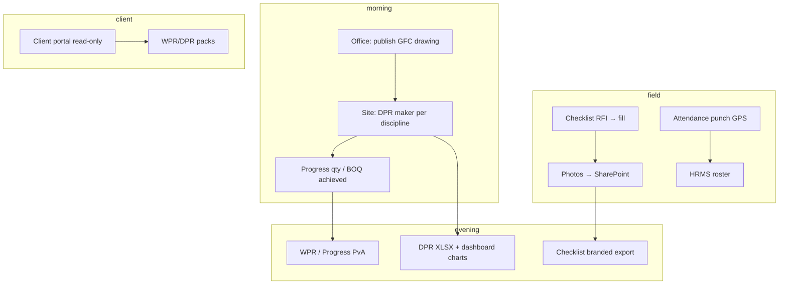

# Sharnam Portal — Structured QA, workflow & security review

**Purpose:** Module-by-module test order, daily project data flow, checklist parity, and security checklist before production sign-off.

**Live:** https://portal.spdc.in · Demo: `Demo@1234` · Project: SPDC-DEMO-01

---

## 1. Daily project workflow (data flow)



| Step | Who | Module | Verify |
|------|-----|--------|--------|
| 1 | Office | Drawings → publish revision | File on SharePoint `04.02` |
| 2 | Site | DPR maker (CIVIL/ELEC/…) | S-curve INPUT rows 125–137 filled |
| 3 | Site | Checklist fill (RFI linked) | All lines Yes/No/N.A. + metadata |
| 4 | Office | Progress → PvA / BOQ sync | Activity lines match Cost monitoring |
| 5 | Office | WPR maker → export PPTX | Charts match date range |
| 6 | Client | Dashboard / reports | Read-only, no upload |

---

## 2. Module test order (sign off one by one)

Use [client-share/03-Module-Test-Plan.md](./client-share/03-Module-Test-Plan.md) and mark Pass/Fail.

| # | Module | Critical path | Roles |
|---|--------|---------------|-------|
| 1 | Master + Directory | Create project, enable modules, add parties | Office |
| 2 | Drawings / GFC | Upload modal → drawing check → publish | Office, Site, Client |
| 3 | DMS | Browse ISO tree, upload, PDF preview | Office, Site |
| 4 | Quality + Checklists | Assign → RFI → fill → export XLSX | Office, Vendor |
| 5 | Safety checklists | SPDC HSE pack seed → fill (min 3 photos) | Site, Vendor |
| 6 | Progress + PvA | Upload dashboard xlsx, sync BOQ, add rows | Office |
| 7 | Cost | Structure setup → monitoring → MB → BBS | Office |
| 8 | DPR / WPR | Maker save, download, publish SharePoint | Office, Client |
| 9 | Comms | Matrix → MoM → follow-up | Office |
| 10 | HRMS | Recruitment → appointment → payslip | Office |

---

## 3. Checklist filling — test matrix

| Case | Steps | Expected |
|------|-------|----------|
| C1 | Office assigns template → vendor opens fill URL | Form loads all lines |
| C2 | Fill without RFI (site user) | Allowed only if no open RFI gate |
| C3 | Fill with RFI (vendor) | Only assignee / matrix party |
| C4 | Submit with 1 line empty | **400** — all lines required |
| C5 | QI submit with 0 published drawings | Gate for non-office (when enabled) |
| C6 | Sync pack items `POST …/templates/:id/sync-pack` | Real lines from xlsx, not 6 generics |
| C7 | Header metadata (Report No, Location) | Saved in `_meta`, appears in export |
| C8 | Double-click Submit | One submission row |
| C9 | Client opens fill | **403** denied |
| C10 | Branded XLSX after submit | Downloads SPDC-format file |

---

## 4. Cost structure upload — test matrix

| Case | Steps | Expected |
|------|-------|----------|
| K1 | Cost → Structure upload tab | Full setup panel visible (not hidden) |
| K2 | Load SPDC template | Budget + monitoring + MB + BBS rows |
| K3 | Upload new structure (modal) | Package appears in table |
| K4 | Per-structure MB upload (modal) | MB tab opens with rows |
| K5 | Monitoring tab | Single upload via toolbar (no duplicate bar) |
| K6 | Site user structure import | 403 if office-only route |

---

## 5. Security review checklist

| # | Area | Check | Status |
|---|------|-------|--------|
| S1 | JWT secret | Strong `JWT_SECRET` in prod; no demo default | ☐ |
| S2 | Project scope | User A cannot read User B project API | ☐ |
| S3 | Client role | No upload drawings / edit cost | ☐ |
| S4 | File upload | `.xlsx` only on import routes; size limits | ☐ |
| S5 | `/uploads` static | Sensitive files not public in prod | ☐ |
| S6 | CORS | `WEB_ORIGIN` locked to portal domain | ☐ |
| S7 | Checklist fill gate | RFI + role enforced on submit | ☐ |
| S8 | Password in email | No demo password in outbound mail | ☐ |
| S9 | SQL injection | Prisma parameterized queries only | ☐ |
| S10 | Rate limit | Consider on auth + upload endpoints | ☐ |

---

## 6. Known gaps (track in issues)

1. Branded XLSX should fill **original pack workbook** when file exists (not only generic Activity template).
2. 63 Final Index names still unmatched to pack files — run pack inventory after normalize fix.
3. WPR PPTX photo embedding from SharePoint URLs.
4. Finance module UI depth vs Cost.
5. Multi-user concurrent UAT not yet signed off.

---

## 7. Commands for QA session

```bash
# Health
curl -s https://portal.spdc.in/api/health | jq .

# Local seed if empty
npm run db:seed

# Checklist pack inventory
curl -s -H "Authorization: Bearer $TOKEN" \
  http://localhost:4000/api/checklist/pack-inventory

# Sync template from pack
curl -X POST -H "Authorization: Bearer $TOKEN" \
  http://localhost:4000/api/checklist/templates/TEMPLATE_ID/sync-pack
```

---

*SPDC-STRUCTURED-QA-REV01 · Update after each module sign-off session.*
