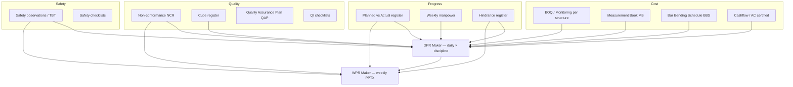
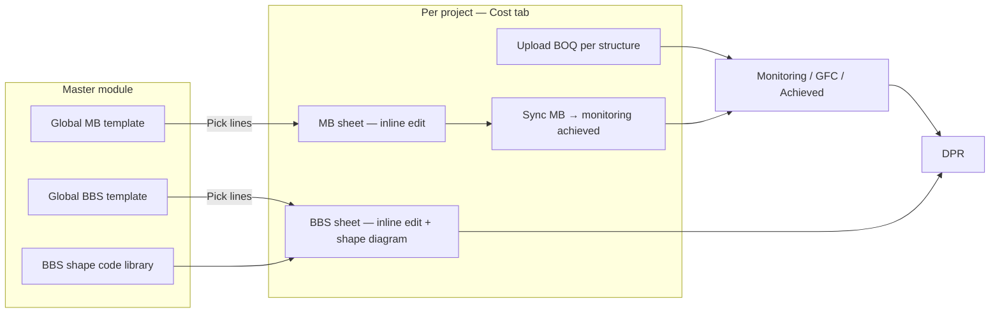
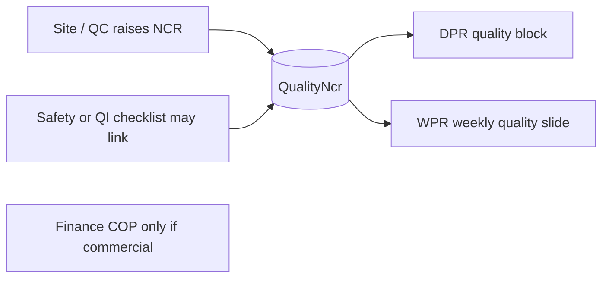
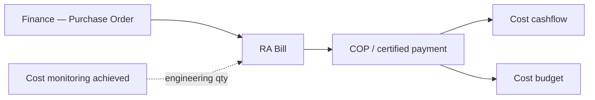

# Sheet connection maps — Sharnam portal

**For client walkthrough · August 2026**

These maps show how your Excel registers connect inside the portal. **Comms matrix** and **Design coordination** are separate tools and are not shown here.

---

## 1. Daily hub — DPR pulls from all site modules

| Excel / client sheet | Portal table | Feeds |
|---------------------|--------------|-------|
| BOQ monitoring (per structure upload) | `CostMonitoringLine` | DPR qty rows |
| MB sheet | `CostMbLine` | DPR cumulative qty |
| BBS sheet + shape master | `CostBbsLine` + `BbsShapeMaster` | DPR rebar kg |
| Planned Vs Actual Dashboard | `ProgressActivityLine` | DPR planned hints |
| Weekly Manpower | `ProgressManpower` | DPR + WPR |
| Hindrance Register | `ProgressHindrance` | DPR delays / issues |
| NCR 01.xlsx | `QualityNcr` | DPR quality + WPR |
| Cube register | `CubeTest` | DPR + WPR |
| QAP | `QapActivity` | WPR quality section |
| Safety dashboard | `SafetyRecord` | DPR HSE + WPR |

---

## 2. Cost module — what you upload vs global master

**Rule:** BOQ is **never** a global master — upload per structure on **Cost → BOQ**. MB/BBS lines come from **global master → pick into project**, then site edits quantities and diagrams.

---

## 3. NCR (Non-conformance) — raise → track → close

| Step | Who | Portal |
|------|-----|--------|
| Raise | Site QC / PMC | **Quality → NCR** — description, location, severity, photos |
| Assign / close | PMC office | Update status, corrective action, close date |
| Daily rollup | Auto | **DPR Maker** quality tests row |
| Weekly rollup | Auto | **WPR Maker** quality section |

NCR is **not** the same as Safety observation — safety items live in **Safety** module; quality defects live in **Quality → NCR**.

---

## 4. Finance ↔ Cost (payment summary)

Official commercial path: **Finance → PO → RA → COP**. Cost **Bills** tab is a quick vendor log only.

---

## 5. Checklists → modules

| Checklist type | Filled by | Connects to |
|----------------|-----------|-------------|
| Site execution | Site | DPR highlights (manual) |
| Quality inspection QI | Site QC | Quality logs, WPR |
| Drawing check | Drawing team | Drawings register |
| Safety | Site | Safety module → DPR HSE |

Fill checklists with **photos + signature** on mobile; branded HTML export for PDF archive.

---

## 6. WPR — same data as DPR, weekly PPTX

Client reference: `SPDC_Arvind Limited_WPR_50.pptx`

Portal: **WPR Maker** → 24 sections auto-seeded → **Download PPTX** (one slide per section + cover).

---

*PNG overview: `docs/client-share/assets/portal-sheet-connections.jpg` (for slide decks)*
