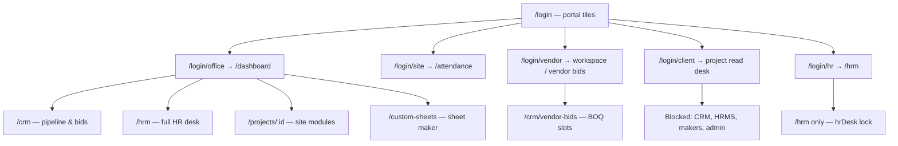
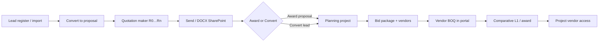
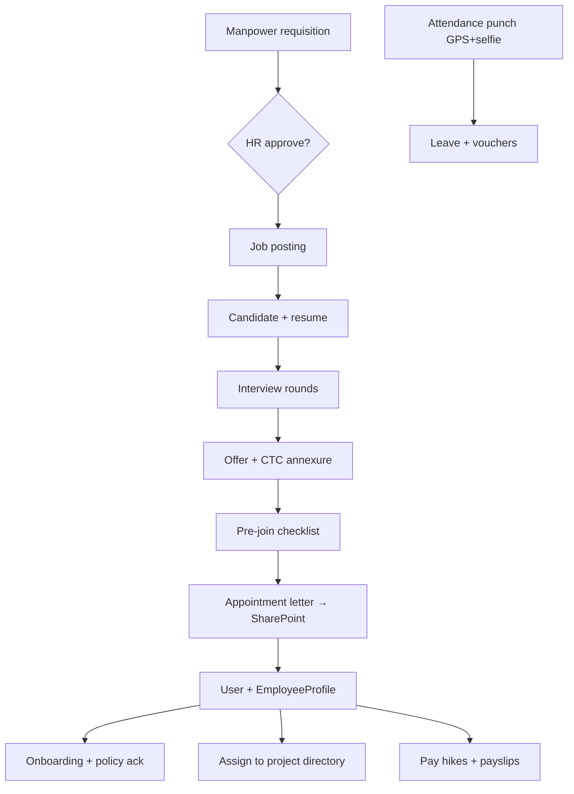

# CRM · HRMS · Custom Sheet Maker — Handover & flows

**Audience:** SPDC office, HR desk, and implementation team  
**Portal:** https://portal.spdc.in (staging/local: `npm run dev`)  
**Demo password:** `Demo@1234` unless your admin changed it  

This document explains **who can access what**, the **end-to-end flows**, how **project module data** feeds a **one-week demo**, and how to produce a **screenshot evidence pack** for client sign-off.

Related checklists:

- [UAT-SCREENSHOT-CHECKLIST.md](../client-share/UAT-SCREENSHOT-CHECKLIST.md) — file names and URLs to capture  
- [14-CRM-HRMS-CustomSheets-UAT.md](../client-share/14-CRM-HRMS-CustomSheets-UAT.md) — step-by-step UAT (do not re-seed production)  
- [02-Logins-and-Access.md](../client-share/02-Logins-and-Access.md) — portal URLs and roles  

---

## 1. User access flow (who lands where)



### Role matrix (simplified)

| Role | CRM desk | HRMS desk | Custom sheets | Project modules | Vendor bids |
|------|:--------:|:---------:|:-------------:|:---------------:|:-----------:|
| **admin** | Full | Full | Full | Full | — |
| **office** | Full | Full | Create/edit | Full | — |
| **hr** | — (redirect to `/hrm`) | Full + users | — | Read projects list only* | — |
| **employee** | — | Self (leave, payslip) | View | Assigned projects | — |
| **site_employee** | — | Self + attendance | — | Assigned + field tools | — |
| **vendor** | Vendor bids only | — | BOQ sheet edit on open bid | Assigned project | **Yes** |
| **client** | — | — | — | Published / shared only | — |

\* **HR desk-only** users (e.g. dedicated HR login): JWT works but API returns **403** outside `/api/hrm` and auth — they cannot open CRM or mutate projects.

**Web guards:** `CrmProtected`, `HrmsProtected`, `ClientPortalGate`, `OfficeDeskGate` in `apps/web/src/App.tsx` and `apps/web/src/pages/crm|hrms/*Protected.tsx`.

**Sign in as (test mode):** Office → **Access · Users** or HRMS → **Users** — use **Back to …** to return to admin when impersonating.

---

## 2. CRM flow (commercial, pre-project)

CRM is **office-confidential**. The pipeline object is **`Lead`** (not a separate Opportunity entity). **`Quotation`** is the SPDC proposal desk. **`CrmBidPackage`** + **`CustomSheet`** power comparative BOQ.



### Typical URLs

| Step | URL |
|------|-----|
| Hub | `/crm` |
| Leads | `/crm/leads` |
| Proposals | `/crm/proposals`, `/crm/proposals/:id` |
| Projects register | `/crm/projects`, `/crm/setup` |
| Bid compare | `/crm/bids`, `/crm/bids/:id` |
| Vendor desk | `/crm/vendor-bids` (vendor login) |

### API spine

- Leads, deals, quotations: `apps/api/src/routes/reports.ts` → `crmRouter` under `/api/crm`
- Bid & comparative: `apps/api/src/routes/crmComparative.ts` under `/api/crm`

### Demo data (local / staging)

| Script | Command |
|--------|---------|
| Base users + leads | `npm run db:seed` |
| Comparative R2 pack | `npm run db:seed-crm-comparative` |
| Full screenshot week + CRM/HRMS | `npm run db:seed-demo-screenshots` |

After screenshot seed: proposal **SPDC/26-27/INQ/78**, comparative bid package, and leads from main seed.

---

## 3. HRMS flow (office HR desk)

HRMS uses **`/hrm/*`** (alias `/hrms/*` → redirect). Recruitment uses a **second router** on the same `/api/hrm` prefix.



### Typical URLs

| Area | URL |
|------|-----|
| Hub | `/hrm` |
| Recruitment | `/hrm/recruitment` |
| Onboarding | `/hrm/onboarding`, `/hrm/onboarding/:offerId` |
| Letters | `/hrm/documents` |
| Payroll | `/hrm/payroll` |
| Attendance | `/hrm/attendance` |
| Leave | `/hrm/leave` |
| Masters / users | `/hrm/masters`, `/hrm/users` |

### Demo personas

| Person | Email | Use |
|--------|-------|-----|
| Full HRMS flow candidate → staff | `riya.shah@sharnam.demo` | Recruitment → letters → payslip path |
| HR desk login | `/login/hr` with office HR account | HR-only lock |
| Site punch | `site@sharnam.demo` | Attendance |

| Script | Command |
|--------|---------|
| Full recruitment → join path | `npm run db:seed-hrms-flow` |
| Letter samples | `npm run hrms:seed-letter-samples` |
| Payslip rows | `npm run db:seed-payslips` (if defined in package.json) |

Included in **`npm run db:seed-demo-screenshots`** after this handover update.

---

## 4. Custom Sheet Maker (Sharnam-branded workbooks)

**Path:** `/custom-sheets` (Office shell — clients blocked)

| Action | What happens |
|--------|----------------|
| **Blank / Upload .xlsx** | Creates `CustomSheet` — headers + rows JSON, formula preview |
| **Edit cells** | Inline save; `=SUM(...)` style formulas recalc in preview |
| **Export** | CSV / SharePoint sync (mock OneDrive in demo) |
| **Project link** | Filter or attach sheet to a project where supported |

**CRM bid BOQs** also use `CustomSheet` but are **hidden** from the maker list (`MAKER_HIDDEN_CATEGORIES`) — vendors edit via **Bid management** / **Vendor bids**.

**Cost masters** (MB/BBS/monitoring templates): `/api/custom-sheets/masters` — global templates, not the same as per-project Cost registers.

**DPR / WPR makers** are **project-scoped** (`/projects/:id/dpr-maker`, `wpr-maker`) — snapshot models, not `CustomSheet`. Use them for weekly branded site reports fed by Quality/Safety/Cost/Progress data.

Spec gap: [MODULE_SHEET_MAKER.md](../modules/MODULE_SHEET_MAKER.md) describes versioned schema templates; implementation is workbook-style rows + formulas (Procore-parity path).

---

## 5. One-week “real work” demo (project modules → DPR/WPR)

Use **SPDC-DEMO-01** (and optionally **SPDC-PILOT-02**) as the anchor project. Other modules already carry Excel-parity registers; the screenshot seed **adds a published 7-day DPR week + WPR week** so reports look like live site work.

```bash
# Fresh local DB (optional)
npm run db:setup

# Or if users/projects exist:
npm run db:seed-demo-screenshots
```

This run enables all module flags on demo projects, seeds Quality/Safety/Finance/Audit from workbooks, links drawing register ↔ GFC, publishes **7 DPR days**, **1 WPR week**, **CRM comparative + quotation**, **HRMS flow + payslip samples**.

Then walk:

1. **Project home** → Load SPDC sheets / verify panels  
2. **Progress / Cost / Quality** — registers populated  
3. **DPR Maker** — disciplines auto-filled from the week seed  
4. **WPR Maker** — client pack + SPDC slides  
5. **CRM / HRMS** — desks populated for screenshots 05–06, 28–29 in UAT checklist  

---

## 6. Screenshot evidence pack (today)

1. Run seed on **staging** (not production unless agreed).  
2. Create folder: `docs/client-share/uat-screenshots/` (or Drive mirror).  
3. Follow [UAT-SCREENSHOT-CHECKLIST.md](../client-share/UAT-SCREENSHOT-CHECKLIST.md) — **1440×900**, `NN-name.png`.  
4. **CRM block:** register, proposal maker, bid comparative, vendor BOQ (05–06, 05a–05c).  
5. **HRMS block:** hub, recruitment tabs, documents preview, payroll slip (28–29 + add `hrm-letters.png`, `hrm-payroll-slip.png` if missing).  
6. **Custom sheets:** blank + upload + export row (add `36-custom-sheets.png` → `/custom-sheets`).  
7. Paste sign-off table from UAT doc §5 into client workbook.

---

## 7. “Complete properly today” — focus gaps

Use [14-CRM-HRMS-CustomSheets-UAT.md](../client-share/14-CRM-HRMS-CustomSheets-UAT.md) as the **pass/fail** script. Known spec vs build gaps (do not block handover if UAT passes):

| Module | Gap | Workaround |
|--------|-----|------------|
| CRM | No separate ClientOrganisation entity — flat lead fields | Use lead client name + convert wizard |
| CRM | Kanban spec vs list/register UI | Register + market columns implemented |
| HRMS | Training & KRA / personal diary tabs | Not separate `/hrm` routes yet |
| HRMS | Posting “publish” to LinkedIn/Naukri API | Manual post + channel audit field |
| Sheets | Template schema versioning | Workbook upload + formula grid |
| Payslip | HTML on Drive vs PDF binary | Browser print to PDF |

**Production:** run `npx prisma migrate deploy` once for department master; **do not** run `db:seed*` on live unless resetting demo.

---

## 8. Quick command reference

```bash
npm run dev                    # local api + web
npm run build                  # CI / Hostinger build
npm run hostinger:build        # production artifact
npm run db:seed                # base demo users + CRM/HRMS in seed.ts
npm run db:seed-demo-screenshots   # week of project data + CRM/HRMS for captures
npm run db:seed-hrms-flow      # HRMS only
npm run db:seed-crm-comparative
```

---

## 9. Handover sign-off (internal)

| Area | Owner | Evidence folder | Date |
|------|-------|-----------------|------|
| CRM pipeline + bids | | `05*` screenshots | |
| HRMS recruitment → pay | | `28–29*` + letters | |
| Custom sheets | | `36*` | |
| Project week (DPR/WPR) | | `22–24`, `dpr-*` | |

When all rows are checked, proceed to **project module** handover using the same screenshot pack and [PHASE2-PROJECT-MODULES-PLAN.md](../client-share/PHASE2-PROJECT-MODULES-PLAN.md).
