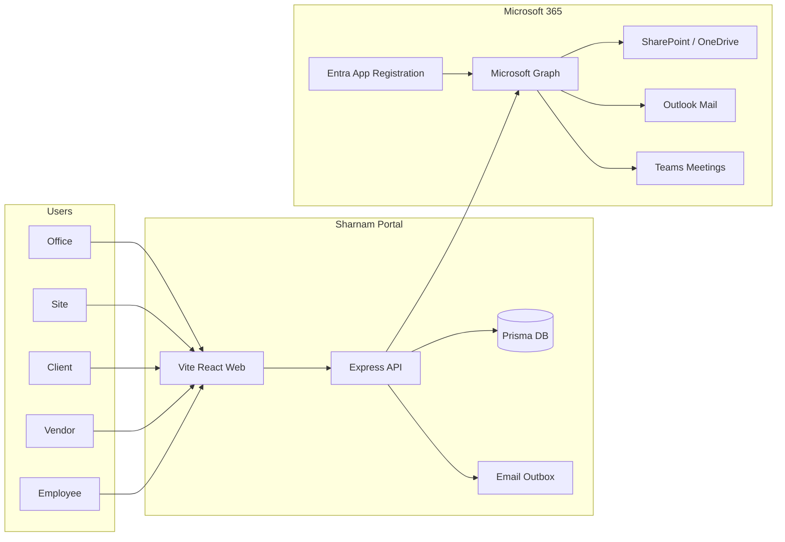
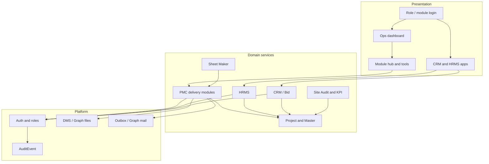

# 00 — High-Level Design (HLD)

**Product:** Sharnam PMC Portal (शरणम्)  
**Version:** 0.1 · 2026-08-03  
**Scope:** System-wide architecture and module map for PMC delivery + office HRMS/CRM

---

## 1. Purpose

Sharnam Portal is a project-scoped construction PMC platform for Sharnam Project Development Consultants. It digitizes Excel-driven PMC registers into live dashboards and workflows, and extends office operations with **HRMS** (people lifecycle) and **CRM** (leads, quotations, vendor bid compare).

**Outcomes:**
- One system of record per project for drawings, quality, safety, progress, field, cost, finance, reports, and RFIs
- Office people lifecycle: recruit → join → attendance/leave → diary → compensation → KPI/KRA
- Commercial pre-project: lead → quotation → vendor compare → convert to project
- Microsoft 365 as the document and communication fabric (SharePoint, Outlook, Teams)

---

## 2. Actors

| Actor | Portal | Primary jobs |
|-------|--------|--------------|
| **Office / Admin** | Office | Master setup, module toggles, CRM, HRMS, Cost/Finance, Comms, Reports |
| **Site employee** | Site | Day log, photos, checklist fills, QI/Safety, Field RFIs, geo attendance |
| **Client** | Client | Civil view: schedule/S-curve, procurement, published drawings, concerns, DPR/WPR, selected QI/Safety |
| **Contractor / Vendor** | Vendor | Fill assigned checklists / inspections, photos, bills where allowed |
| **Employee (HR self-service)** | Employee | Attendance punch, leave, personal diary, payslips, policy ack, training |

Directory Master treats four project parties as tools: **Office · Site · Client · Contractor**. HRMS employees feed the PMC roster and project Directory.

---

## 3. System context

| Boundary | Today | Target |
|----------|-------|--------|
| Auth | JWT + bcrypt local users | Same; optional Entra SSO later (not required for v1 Graph) |
| Files | Mock OneDrive | SharePoint / OneDrive via Graph |
| Mail | Queued outbox | Outlook send via Graph |
| Meetings | Location string | Teams online meetings via Graph |
| Hosting | Render (API + web) | Unchanged — **no Azure app hosting required** |

---

## 4. Logical architecture

**Monorepo layout (exists):**
- `apps/web` — Vite React UI
- `apps/api` — Express routes / services
- `packages/shared` — roles, portals, permission matrix
- `prisma` — schema + migrations
- `docs/` — requirements; this pack under `docs/system-design/`

---

## 5. Module map

### 5.1 Office Master (company-level)

| Module | Purpose | Status |
|--------|---------|--------|
| Master | Projects, packages, module on/off, Directory links | **Exists** |
| Roles / Access | Permission matrix | **Exists** |
| Audit trail | Who / when / what (system AuditEvent) | **Exists** |
| **CRM** | Leads, client card, quotation, vendor compare, convert | **Partial** → **Build next** |
| **HRMS** | Recruit, onboard, attendance, leave, diary, payslips, KPI | **Partial** → **Build next** |
| **Sheet Maker** | Custom register / meeting sheet templates | **Design** |
| **Site Audit tools** | Audit plan, walk, findings (ISO pack) | **Design** |
| **Master KPI / KRA** | ISO subject dashboard + role scorecards | **Design** |

### 5.2 Project modules (per `projectId`)

| Module | Tools (summary) | Status |
|--------|-----------------|--------|
| Home | Overview, Directory (4 parties), Vendors, DMS | **Exists** |
| Drawings | GFC register, checklist manager, DMS, coordination, **Request for Information** | **Exists** (naming clarify) |
| Quality | QI, checklist master + Excel, QAP, NCR, **Request for Inspection** | **Exists** (naming clarify) |
| Safety | Dashboard, checklists, **Request for Inspection** | **Exists** (naming clarify) |
| Progress | Overview, milestones, S-curve, summary schedule, MS Project progress, procurement, monthly, hindrance, risk, legal | **Partial** |
| Field | Day log, photos, Field RFIs | **Exists** |
| Comms | Matrix, Meetings → Agenda → MoM, Ask, Email; **Teams** meetings | **Partial** |
| Cost | Monitoring, MB, BBS, Budget, Cashflow, rates, BOQ | **Exists** |
| Finance | Invoice, PO, RA, COP | **Partial** (shell) |
| Reports | DPR / WPR packs | **Exists** |

### 5.3 Naming rule for “RFI”

| Surface | Term | Meaning |
|---------|------|---------|
| Drawings / PMC Ask | **Request for Information** | Clarification / information only |
| Quality / Safety | **Request for Inspection** | Request to inspect / fill QI or safety checklist |
| Field | Field RFI | Operational ask; kind stored on `Rfi.rfiKind` |

UI labels must match this rule; internal `rfiKind` enum extends as needed (`RequestForInformation`, `QualityInspection`, `SafetyChecklist`, …).

---

## 6. Cross-cutting rules (non-negotiable)

1. **Project scope** — every delivery query filters by `projectId` or membership; no cross-project leakage.
2. **Idempotency** — upserts / unique keys for assign, publish, submit, attendance punch retries.
3. **Drawing gate** — checklist submit + QI create require ≥1 published drawing with file where product gate applies.
4. **Client role** — view / raise concerns; no drawing upload; commercial edits only if explicitly permitted.
5. **Audit** — who / when / entity / meta on fills, uploads, approvals, punches, quotation publish.
6. **Upload UX** — dedicated modal (Procore-like), not bare file input alone.
7. **Sheet → dashboard** — client Excel packs become portal tools; Excel is template, portal is system of record.
8. **PDF** — upload + in-app view for civil packs and generated docs.
9. **Microsoft 365** — Graph after Entra app registration; mocks until credentials live.

---

## 7. Key end-to-end value streams

| Stream | Summary | Detail |
|--------|---------|--------|
| Recruit → join | Requisition → interview → offer → pre-join → onboard → Directory | [02-LLD-HRMS.md](./02-LLD-HRMS.md), [09-Flows.md](./09-Flows.md) |
| Geo attendance | Assigned site geofence + selfie geotag → attendance | HRMS LLD |
| Lead → project | Lead → quote → compare vendors → convert → Project | [03-LLD-CRM.md](./03-LLD-CRM.md) |
| Drawing publish | Checklist unlock → revision upload → publish → notify | Project modules LLD |
| Inspection | Request for Inspection → fill → QI/NCR | Project modules LLD |
| Site audit | Plan → interview / walk → findings → KPI RAG | [05-LLD-Audit-KPI.md](./05-LLD-Audit-KPI.md) |
| Meeting | Schedule Teams meeting → agenda → MoM → outbox | Comms + Graph LLD |

---

## 8. Phased delivery map

| Phase | Focus | Outcome |
|-------|-------|---------|
| **P0** | This design pack + SRS delta review | Shared truth for team |
| **P1** | RFI naming + UI polish + Sheet Maker MVP + Graph app wiring | Delivery clarity + M365 live path |
| **P2** | CRM depth: client linked search, quotation DOCX, comparative statement | Bid-ready office CRM |
| **P3** | HRMS depth: masters, geo attendance, leave/holiday, diary link, payslips | Operational HR |
| **P4** | Recruitment / onboarding workflows | Full hire pipeline |
| **P5** | Site Audit + Master KPI/KRA + training appraisals | Assurance & performance |
| **P6** | Finance detail, Progress civil extras, snag / closure (roadmap) | Commercial + close-out |

**Exists today (pilot-ready PMC core):** Drawings, checklists, QI/Safety, Field, Comms matrix/meetings shell, Cost, Reports, Directory/Vendors, CRM/HRM MVP shells.

---

## 9. Non-functional requirements

| Area | Requirement |
|------|-------------|
| Security | JWT auth; role + portal checks; secrets only in env; Graph app-only or delegated per [07](./07-LLD-Microsoft-Graph.md) |
| Privacy | Aadhaar/PAN/bank encrypted at rest or vaulted; access limited to HR roles |
| Performance | Project-scoped indexes; list pages paginated |
| Reliability | Idempotent writes; outbox retry for mail |
| Auditability | `AuditEvent` for sensitive actions |
| Mobile | Site attendance + diary usable on phone browser (responsive); native app out of scope |
| Localization | English UI; INR commercial defaults |

---

## 10. Document ownership

| Doc | Owner |
|-----|--------|
| HLD / LLD pack | Product + eng lead |
| Client SRS merge | Product after sign-off |
| Graph credentials | Client M365 admin + eng |

Next: [01-LLD-Architecture.md](./01-LLD-Architecture.md).
