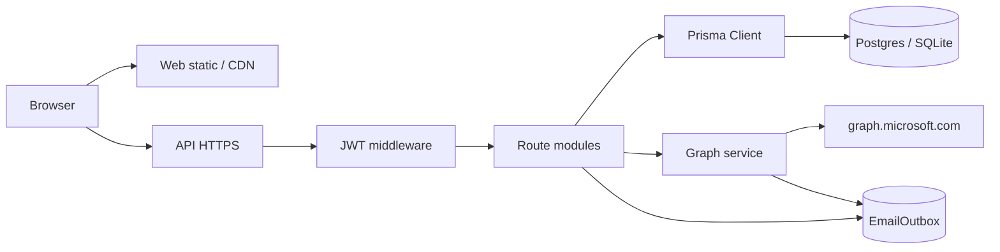
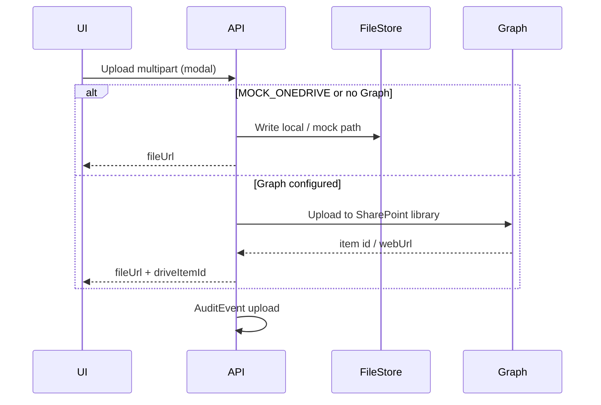

# 01 — LLD: Architecture

**Version:** 0.1 · 2026-08-03  
**Depends on:** [00-HLD.md](./00-HLD.md)

---

## 1. Stack

| Layer | Choice | Location |
|-------|--------|----------|
| Web | Vite + React | `apps/web` |
| API | Express (Node) | `apps/api` |
| ORM / DB | Prisma · SQLite (dev) / Postgres (prod) | `prisma/` |
| Shared | Roles, portals, permissions | `packages/shared` |
| Files (demo) | Local / mock OneDrive | `apps/api` + `uploads/` |
| Files (prod target) | SharePoint / OneDrive via Microsoft Graph | Graph client service |
| Mail | `EmailOutbox` → Graph `Mail.Send` when configured | `EmailOutbox` model |
| Auth | JWT + bcrypt | `apps/api/src/auth.ts` |
| Deploy | Render | `DEPLOY_RENDER.md` |

**Not required:** Azure App Service / Azure hosting. Client needs **Microsoft 365** + **Entra app registration** only.

---

## 2. Runtime topology

**API mount prefixes (exists):**  
`/api/auth`, `/roles`, `/users`, `/projects`, `/dms`, `/drawings`, `/checklist`, `/diary`, `/comms`, `/cost`, `/reports`, `/audit`, `/crm`, `/hrm`, `/vendors`, `/rfis`, `/inspections`, `/directory`, `/safety`, `/progress`.

**Proposed additions:** `/api/hrm/*` expansion, `/api/crm/quotations`, `/api/crm/comparatives`, `/api/sheet-templates`, `/api/site-audits`, `/api/kpi`, `/api/graph/*` health.

---

## 3. AuthN / AuthZ

### 3.1 Authentication (**Exists**)

- `POST /api/auth/login` → JWT  
- Password hashing: bcrypt  
- Portals: `office`, `site`, `client`, `vendor`, `employee` (and module login variants)

### 3.2 Authorization

| Mechanism | Rule |
|-----------|------|
| `requireAuth` | Valid JWT |
| `requireRoles` | Role allow-list on route |
| Project membership | `ProjectMember` / Directory assignment for project routes |
| Communication Matrix | RFI respond / close limited to matrix parties (+ office) |
| HRMS | Employee self vs HR office vs reporting manager |
| CRM | Office-only for commercial quotation / compare (default) |

### 3.3 Roles (baseline)

`admin`, `office`, `site_employee`, `client`, `employee`, `vendor` — extend permission matrix in `packages/shared` when HRMS/CRM deep actions land (e.g. `hrm.approve_leave`, `crm.publish_quote`).

### 3.4 Future (Design, not v1)

- Optional Entra ID / MSAL login for Office users  
- Does **not** block Graph app-permissions mail/files (client credentials)

---

## 4. Multi-tenancy model

**Tenant = Project** for delivery data.

| Data class | Scope key | Examples |
|------------|-----------|----------|
| Project delivery | `projectId` | Drawings, RFIs, QI, Cost, Meetings, Day log |
| Company HRMS | org-wide (+ optional `projectId` assignment) | Employees, leave types, holidays, candidates |
| CRM | org-wide until convert | Leads, quotations; then `projectId` on convert |
| Masters | org-wide | LeaveType, Holiday, SheetTemplate (global or project-cloned) |
| KPI subjects | `projectId` | ISO subject RAG per project |

**Rule:** Never return another project’s rows. HRMS employee lists are company-scoped but **project Directory** only shows assigned members.

---

## 5. Data integrity patterns

| Pattern | When | Implementation sketch |
|---------|------|------------------------|
| Unique composite | Attendance per day | `@@unique([userId, date])` (**Exists**) |
| Idempotent upsert | Punch / assign / publish | PUT upsert or client `Idempotency-Key` |
| Sequential numbers | RFI, offer, quotation | Per-project or per-org counter transaction |
| Soft gates | Drawing unlock | Server rejects upload if checklist incomplete |
| Optimistic concurrency | Quotation edit | `updatedAt` / version check |
| Audit append-only | Sensitive writes | `AuditEvent` row |

---

## 6. File storage boundary

**Applies to:** drawing revisions, DMS, payslip PDFs, quotation DOCX/PDF, audit evidence photos, attendance selfies (store path + hash; PII retention policy).

---

## 7. Notification boundary

| Event | Channel |
|-------|---------|
| RFI create / respond | EmailOutbox → Graph Mail |
| Drawing publish | EmailOutbox |
| Meeting invite | Graph Calendar + Teams onlineMeeting |
| Leave approved / rejected | In-app + optional mail |
| Offer released | Mail to candidate |
| Quotation sent | Mail to client contact |

Until Graph is live, all mail stays in **Email outbox** UI (exists).

---

## 8. Error and API conventions

| Item | Convention |
|------|------------|
| Success | `200` / `201` + JSON entity or `{ items, total }` |
| Validation | `400` + `{ error, fields? }` |
| Auth | `401` / `403` |
| Missing | `404` |
| Conflict / gate | `409` (e.g. drawing gate, duplicate punch) |
| Dates | ISO-8601 UTC in API; display local in UI |
| Money | Number + currency code `INR` default |
| IDs | `cuid` strings |

---

## 9. Observability

- Structured request logs (projectId, userId, route)  
- Persist `AuditEvent` for domain actions  
- Graph failures: log + leave outbox row `Failed` with reason  
- Health: `GET /api/health` (exists or add) + `GET /api/graph/status` (**Design**)

---

## 10. Security notes (HR / CRM)

| Data | Control |
|------|---------|
| Aadhaar / PAN / bank | HR roles only; mask in lists; full view audited |
| Attendance selfie + GPS | Retention period configurable; not public URLs without auth |
| Quotation commercial | Office-only; watermark “Confidential” on generated docs |
| Client Graph secret | Server env only; never ship to web |

---

## 11. Alignment with existing code

| Concern | File / area |
|---------|-------------|
| JWT | `apps/api/src/auth.ts` |
| Schema | `prisma/schema.prisma` |
| CRM/HRM MVP routes | `apps/api` reports/crm/hrm routers |
| Mock files | `mockOneDrive` service |
| M365 setup clicks | `docs/M365_SETUP.md` |
| IA | `PRODUCT_IA.md` |

Implementers extend schemas and routes **incrementally**; do not break project-scoped queries or existing pilot modules.

Next: [02-LLD-HRMS.md](./02-LLD-HRMS.md).
