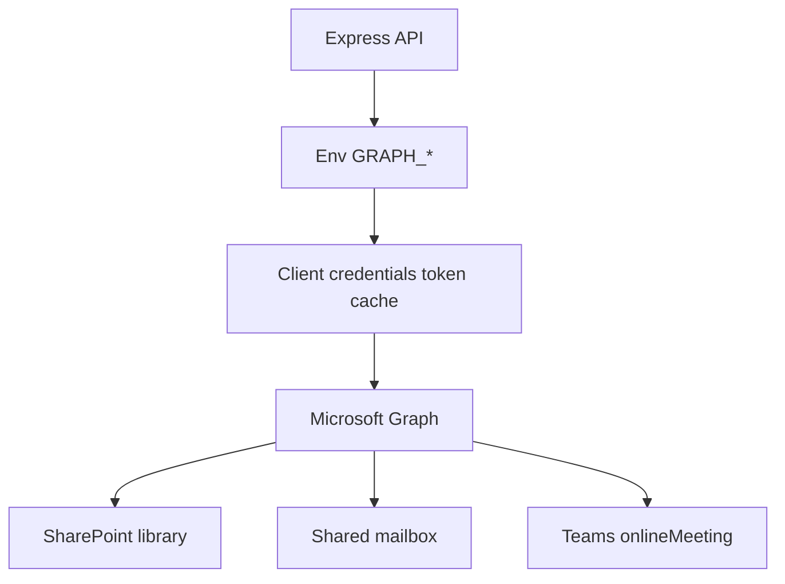

# 07 — LLD: Microsoft Graph (Entra App Registration)

**Version:** 0.1 · 2026-08-03  
**Status:** Documented setup **Exists** in [`M365_SETUP.md`](../M365_SETUP.md) · live Graph client **Design / Build next**  
**Important:** Client has **SharePoint + Outlook** (Microsoft 365). They do **not** need Azure hosting. They **can** complete **App registration** in Microsoft Entra ID.

Meetings: **Microsoft Teams only**.

---

## 1. Goal

Replace mocks with Graph for:
- SharePoint / OneDrive file storage (drawings, DMS, evidence)
- Outlook mail send (RFI, publish, MoM, quotations, offers)
- Teams online meetings (Comms + HR interviews)
- Optional MS Project / schedule progress when licensed

---

## 2. Architecture



| Mode | When |
|------|------|
| Mock | `MOCK_ONEDRIVE=true` or missing GRAPH credentials |
| Live | Tenant ID + Client ID + Client secret + consented permissions |

---

## 3. Entra app registration (client actions)

Detailed click-path: [`docs/M365_SETUP.md`](../M365_SETUP.md) § A.

Summary:
1. Entra admin center → App registrations → **Sharnam Portal**
2. Single tenant  
3. Create client secret  
4. Add Microsoft Graph **application** permissions (below)  
5. **Grant admin consent**  
6. Send Tenant ID, Client ID, Secret, SharePoint site URL, shared mailbox to eng  

No Azure subscription for hosting is required for this step.

---

## 4. Permission matrix

### Files / SharePoint

| Permission | Use |
|------------|-----|
| `Files.ReadWrite.All` | Upload / sync files |
| `Sites.ReadWrite.All` | Project document libraries |

### Mail

| Permission | Use |
|------------|-----|
| `Mail.Send` | Send as shared mailbox |
| `Mail.ReadWrite` | Optional sent-item sync |

### Calendar / Teams

| Permission | Use |
|------------|-----|
| `Calendars.ReadWrite` | Meeting invites |
| `OnlineMeetings.ReadWrite.All` | Create Teams meetings (application) |

> If application permission for OnlineMeetings is restricted in tenant, use **delegated** flow for a service user — document fallback in implementation notes.

### Optional schedule

| Permission | Use |
|------------|-----|
| `Project.Read.All` / `Tasks.Read.All` | S-curve / progress when licensed |

---

## 5. Environment variables

Extend `.env` (see `.env.example` + M365_SETUP):

| Variable | Purpose |
|----------|---------|
| `GRAPH_TENANT_ID` | Directory ID |
| `GRAPH_CLIENT_ID` | Application ID |
| `GRAPH_CLIENT_SECRET` | Secret value |
| `GRAPH_SHARED_MAILBOX` | e.g. projects@spdc.in |
| `GRAPH_SHAREPOINT_SITE_ID` or site URL | DMS root |
| `GRAPH_DRIVE_ID` | Optional default drive |
| `MOCK_ONEDRIVE` | `true` until live |

---

## 6. Service design (API)

### GraphService responsibilities

| Method | Behavior |
|--------|----------|
| `getToken()` | Client credentials; cache until expiry |
| `uploadFile(path, buffer, meta)` | SharePoint path per project |
| `sendMail({ to, subject, body, fromMailbox })` | Prefer shared mailbox |
| `createTeamsMeeting({ subject, start, end, attendees })` | Returns joinUrl + meetingId |
| `health()` | Token acquire + optional site probe |

### EmailOutbox integration

1. Domain code inserts `EmailOutbox` row (unchanged).  
2. Worker / inline flush: if Graph configured → send → mark Sent; else leave Queued.  
3. On failure → Failed + error message.

### Meeting integration

On `POST /api/comms/meetings` (or PATCH schedule):
1. If Graph live → `createTeamsMeeting`  
2. Store `teamsMeetingUrl` on `Meeting`  
3. Optionally create calendar invite to matrix attendees  
4. Still support agenda/MoM in portal  

HR interview schedule uses the same helper.

---

## 7. SharePoint folder convention

```
/Sharnam Portal/{projectCode}/
  Drawings/
  DMS/
  Quality/
  Safety/
  Comms/
  CRM/                (office library or separate site)
  HRMS/               (restricted library)
  Audits/
```

Permissions: HRMS and CRM commercial folders restricted via SharePoint ACLs + portal auth.

---

## 8. APIs (portal)

| Method | Path | Purpose |
|--------|------|---------|
| GET | `/api/graph/status` | Configured? token ok? mock? |
| POST | `/api/graph/test-mail` | Admin-only test send |
| POST | `/api/graph/test-meeting` | Admin-only Teams create |

---

## 9. Security

- Secrets only on API server  
- Admin consent required before production send  
- Audit all Graph sends and meeting creates  
- Do not log access tokens  

---

## 10. Acceptance checklist

- [ ] App registered + admin consent green  
- [ ] Upload drawing revision lands in SharePoint (not only local)  
- [ ] Raise RFI → real Outlook message from shared mailbox  
- [ ] Schedule meeting → Teams join link on Meeting record  
- [ ] `GET /api/graph/status` reports healthy  
- [ ] With credentials removed, portal falls back to mock/outbox without crash  

Operational guide remains [`M365_SETUP.md`](../M365_SETUP.md). Client ask list: [`CLIENT_MICROSOFT_REQUEST.md`](../../CLIENT_MICROSOFT_REQUEST.md).

Next: [08-Data-Model.md](./08-Data-Model.md).
