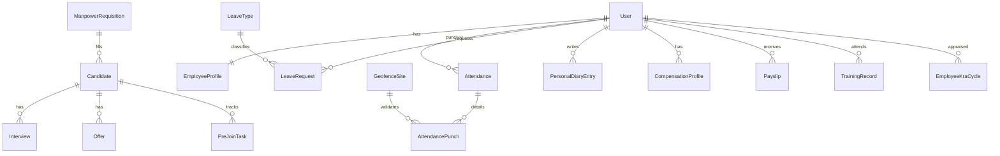
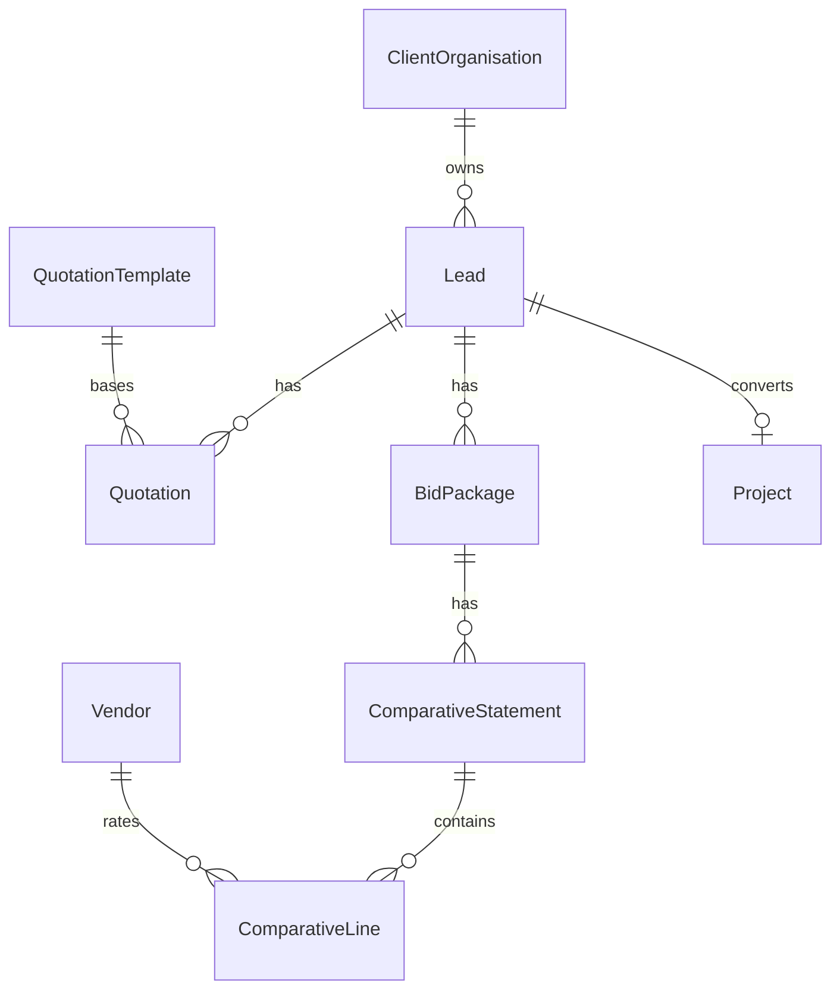

# 08 — Data Model (Existing + Proposed)

**Version:** 0.1 · 2026-08-03  
**Source of truth today:** [`prisma/schema.prisma`](../../prisma/schema.prisma)  
**This doc:** map of existing models + proposed entities from HRMS / CRM / Audit / KPI / Sheet Maker LLDs

---

## 1. Legend

| Tag | Meaning |
|-----|---------|
| **E** | Exists in Prisma |
| **X** | Extend existing model (add fields) |
| **N** | New model (proposed) |

---

## 2. Platform & identity (**E**)

| Model | Notes |
|-------|-------|
| User | Auth identity, role, portal |
| RoleDefinition | Permission matrix |
| Project | Delivery container + client card fields |
| ProjectMember | User ↔ project |
| EmailOutbox | Queued mail |
| AuditEvent | Append-only trail |
| DocumentFolder | DMS tree |

---

## 3. PMC delivery (**E**)

| Domain | Models |
|--------|--------|
| Drawings | Drawing, DrawingRevision |
| Checklists | ChecklistTemplate, ChecklistItem, ChecklistAssignment, ChecklistSubmission, ChecklistPhoto |
| Field | DailyLog, DailyLogManpower, DailyLogEquipment, DailyLogNote, DailyLogPhoto, ProjectPhoto |
| Comms | CommunicationMatrix, CommunicationContact, CommunicationLog, Meeting, MeetingItem |
| Cost | VendorBill, CostBudgetLine, CostMonitoringLine, CostMbLine, CostBbsLine, CostCashflowPeriod, CostRateDifference, BoqImportBatch, BoqItem |
| RFI | Rfi, RfiResponse |
| Quality | QualityInspection, InspectionItem, QapActivity, CubeTest, QualityNcr |
| Safety | SafetyRecord |
| Progress | ProgressMilestone, ProgressHindrance, ProgressRisk, ProgressPlannedActual, ProgressLegalApproval, ProgressManpower, ProgressActivityLine, ProgressSorStat |
| Other | Vendor, ProjectVendor, Submittal (dormant), DesignCoordinationIssue |

---

## 4. CRM / HRM today (**E** / **X**)

| Model | Tag | Changes |
|-------|-----|---------|
| Lead | **X** | organisationId, address, gst, source, inquiryRef, notes, lostReason |
| Deal | **E** | — |
| EmployeeProfile | **X** | status, reportingManagerId, defaultProjectId, personalDefaultsJson |
| Attendance | **X** | source; link punches |
| LeaveRequest | **X** | leaveTypeId, dayCount, approverId, decidedAt |
| Vendor | **E** | Reused by CRM bid |

---

## 5. Proposed HRMS (**N** / **X**)

| Model | Tag | Key fields |
|-------|-----|------------|
| ManpowerRequisition | **N** | department, designation, headcount, status |
| Candidate | **N** | contact, resumeUrl, status, requisitionId |
| Interview | **N** | roundType, scheduledAt, teamsMeetingUrl, scorecard |
| Offer | **N** | ctc, joinDate, status, offerLetterUrl |
| PreJoinTask | **N** | type, status, fileUrl |
| OnboardingProfile | **N** or JSON on EmployeeProfile | bank, KYC, PF/ESIC, nominee, policy ack |
| GeofenceSite | **N** | projectId, lat, lng, radiusMeters |
| AttendancePunch | **N** | lat, lng, selfieUrl, verificationStatus |
| LeaveType | **N** | code, name, maxDays, carryForward |
| HolidayCalendar | **N** | date, name, region |
| PersonalDiaryEntry | **N** | userId, date, body |
| CompensationProfile | **N** | ctcAnnual, allowancesJson |
| Payslip | **N** | periodYYYYMM, fileUrl |
| TrainingRecord | **N** | title, trainedOn, certificateUrl |
| EmployeeKraCycle | **N** | period, roleTemplate, scores |
| EmployeeKpiLine | **N** | target, actual, rag |
| HrPolicyDocument | **N** | version, fileUrl |

---

## 6. Proposed CRM (**N**)

| Model | Tag | Key fields |
|-------|-----|------------|
| ClientOrganisation | **N** | legalName, gstNumber, contacts |
| QuotationTemplate | **N** | sections schema / DOCX master |
| Quotation | **N** | number, revision, sectionsJson, commercialJson, urls |
| BidPackage | **N** | leadId, title, status |
| ComparativeStatement | **N** | vendorColumnsJson, revisionLabel |
| ComparativeLine | **N** | itemCode, qty, unit, ratesJson |
| BidDocument | **N** | bidPackageId, fileUrl |

---

## 7. Proposed Audit / KPI (**N**)

| Model | Tag | Key fields |
|-------|-----|------------|
| SiteAudit | **N** | projectId, status, leadAuditorId |
| SiteAuditChecklistItem | **N** | section, prompt, response |
| SiteAuditFinding | **N** | severity, isoArea, status, CAPA |
| KpiIsoArea | **N** | code, name (global seed) |
| KpiFolder | **N** | areaCode, folderCode |
| KpiSubject | **N** | projectId, counts, rag, kraScore |
| KpiTrendPoint | **N** | capturedOn, counts |
| RoleKraTemplate | **N** | roleKey |
| RoleKraItem | **N** | kra text, kpi targets |

---

## 8. Proposed Sheet Maker (**N**)

| Model | Tag | Key fields |
|-------|-----|------------|
| SheetTemplate | **N** | schemaJson, version, category |
| SheetInstance | **N** | templateId, dataJson, contextType/Id |

**X on Meeting:** `sheetTemplateId`, `teamsMeetingUrl`, `teamsMeetingId`

---

## 9. Proposed Finance (**N** — later phase)

| Model | Tag |
|-------|-----|
| FinanceInvoice | **N** |
| FinancePurchaseOrder | **N** |
| FinanceRaBill | **N** |
| FinanceCop | **N** |

Keep separate from Cost_* models.

---

## 10. Indexing guidelines

| Area | Indexes |
|------|---------|
| All project tables | `projectId` |
| Attendance | `@@unique([userId, date])` (**E**) |
| LeaveRequest | userId, status |
| Lead | stage, organisationId |
| Quotation | leadId, number+revision unique |
| ComparativeLine | comparativeId, sortOrder |
| KpiSubject | projectId + folder/subject |
| SiteAuditFinding | auditId, status |
| SheetInstance | contextType + contextId |

---

## 11. Migration strategy

1. Additive migrations only during pilot  
2. Seed LeaveType / Holiday / RoleKraTemplate / KpiIsoArea from Excel packs  
3. Backfill EmployeeProfile extensions as nullable  
4. Feature-flag new routes until UI ships  

Full Prisma sketches live in domain LLDs; implementers translate to `schema.prisma` per phase (see HLD §8).

Next: [09-Flows.md](./09-Flows.md).
