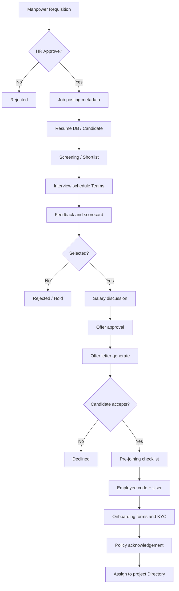
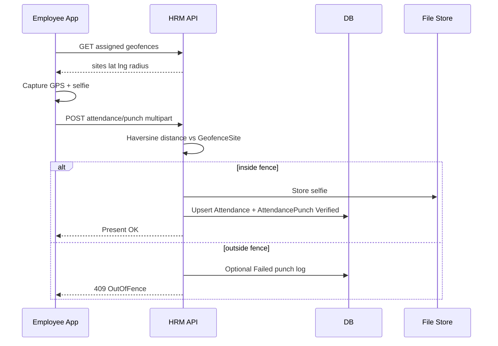
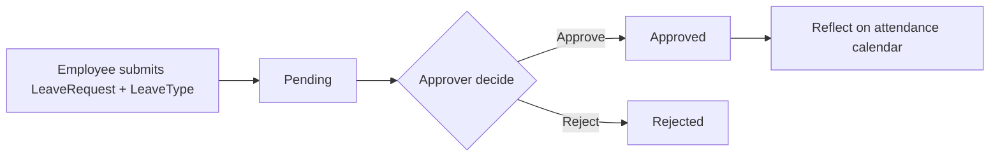
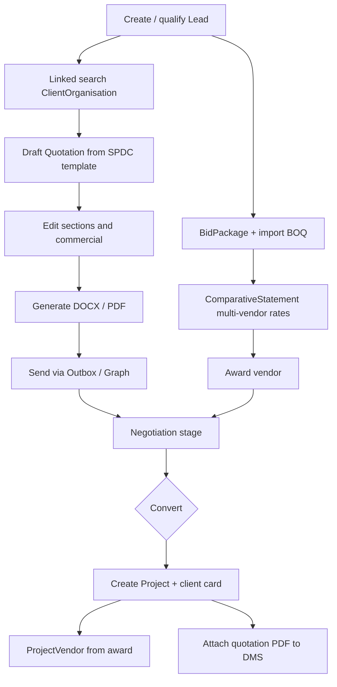
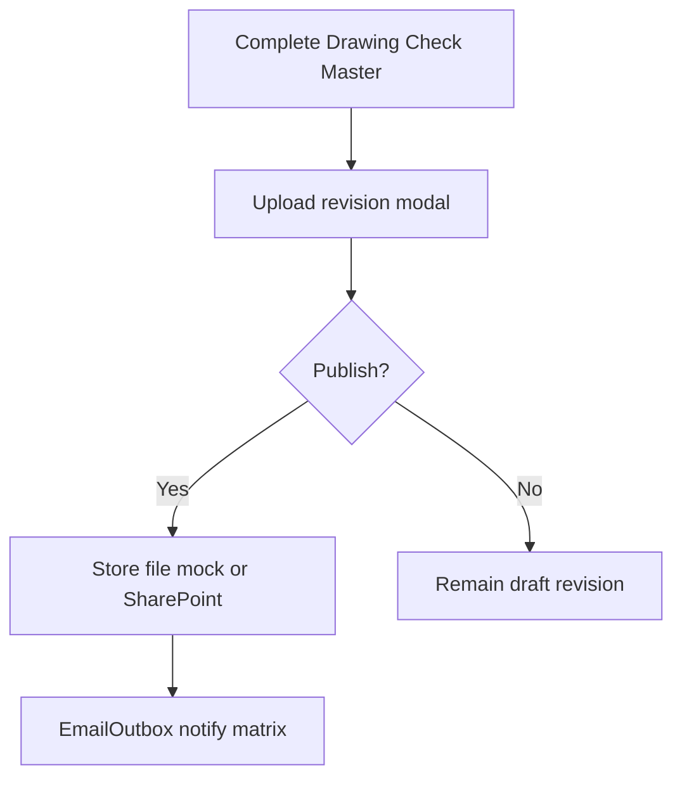
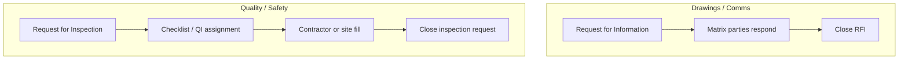
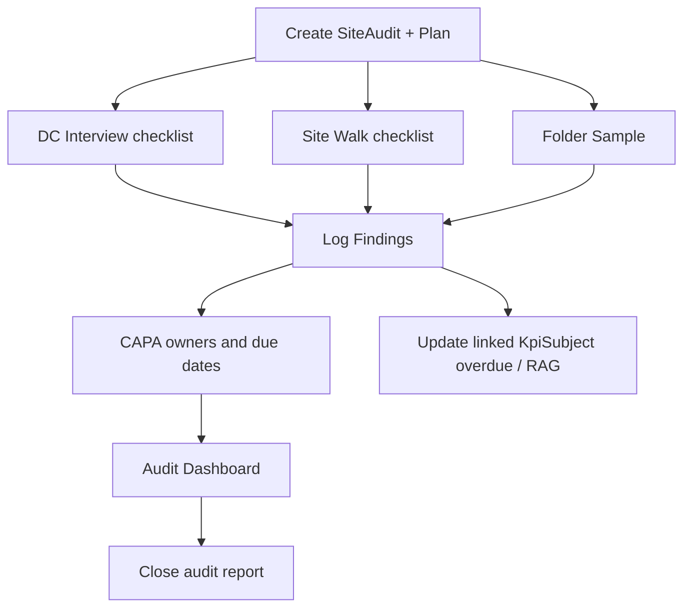
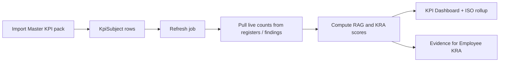
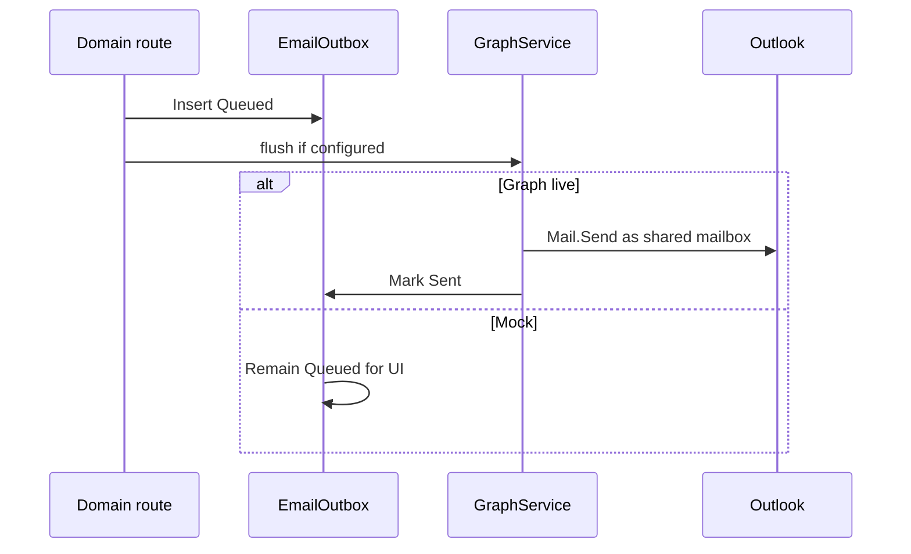
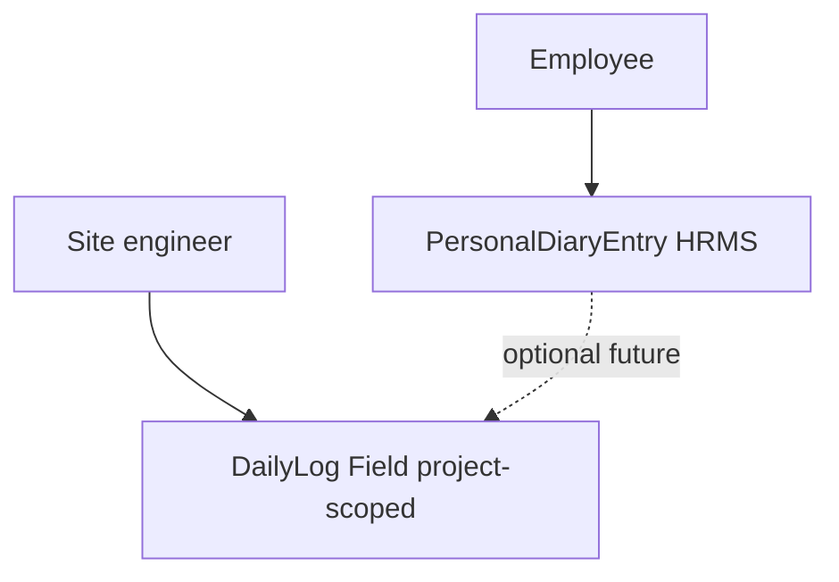

# 09 — End-to-End Flows

**Version:** 0.1 · 2026-08-03  
Mermaid flows for implementers and client walkthroughs. Domain field detail: HRMS / CRM / Audit LLDs.

---

## 1. Recruit → Onboard → Directory



---

## 2. Geo attendance punch



HR override path: `POST /attendance/override` → AuditEvent (no selfie required).

---

## 3. Leave request



Holiday master blocks / informs day count calculation.

---

## 4. Lead → Quotation → Compare → Project



---

## 5. Drawing publish gate



---

## 6. Request for Information vs Inspection



---

## 7. Meeting with Teams + Sheet Maker

```mermaid
sequenceDiagram
  participant Off as Office
  participant API as Comms API
  participant SM as Sheet Maker
  participant G as Microsoft Graph

  Off->>SM: Pick published SheetTemplate
  Off->>API: Create Meeting + templateId
  API->>G: createTeamsMeeting
  G-->>API: joinUrl
  API->>API: Create SheetInstance
  API-->>Off: Meeting with Teams link
  Off->>API: Agenda / MoM / finalize sheet
  API->>API: EmailOutbox MoM PDF
```

---

## 8. Site audit cycle



---

## 9. KPI refresh



---

## 10. Graph mail send



---

## 11. Personal diary vs Field day log



Keep separate storage and permissions in v1.

Next: [10-Client-SRS-Delta.md](./10-Client-SRS-Delta.md).
